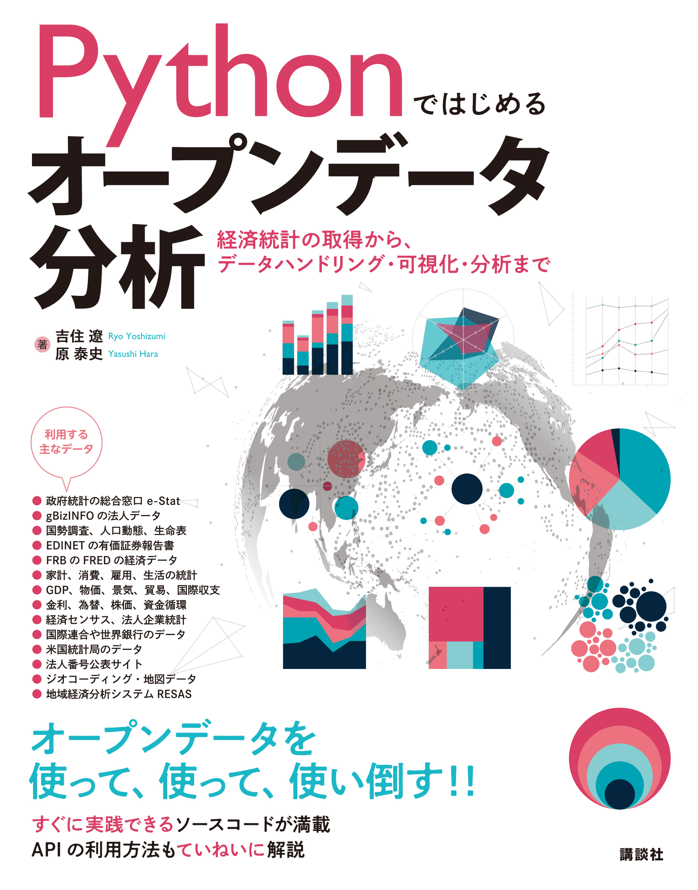

# Pythonではじめるオープンデータ分析
## ―経済統計の取得からデータハンドリング、可視化、分析まで―

著者：**吉住遼**（[@well_living_ry](https://x.com/well_living_ry)）・**原泰史**（[@harayasushi](https://x.com/harayasushi)）

- [講談社サイエンティフィク](https://www.kspub.co.jp/book/detail/5412251.html)
- [講談社](https://www.kodansha.co.jp/book/products/0000419304)
- [版元ドットコム](https://www.hanmoto.com/bd/isbn/9784065412251)
- [国会図書館リサーチ](https://ndlsearch.ndl.go.jp/books/R100000137-I9784065412251)

本リポジトリは、書籍「Pythonではじめるオープンデータ分析 -経済統計の取得からデータハンドリング、可視化、分析まで-」のサポートサイトです。

 
     

本書のハッシュタグは #pythonopendatabook です。

## 本書の概要

[本書](https://www.kodansha.co.jp/book/products/0000419304)は、オープンデータや統計データの活用方法について、できる限り包括的にまとめた本です。
オープンデータとはそもそも何で、どうすれば取得できるのか、何ができるのかを、プログラミング言語Pythonを用いて実践的に学べます。

本書は3部構成です。
第1部では、本書の第Ⅱ部以降のオープンデータや経済統計を扱う際に必要となる基本的なデータの取得、ハンドリング、可視化をPythonで行う方法を紹介します。
第2部では、人口、家計、企業、金融、経済などさまざまなオープンデータ・経済統計・公的統計を取得し、可視化、分析する方法を説明します。
第3部では、オープンデータを活用し、具体的な社会事象をデータに基づいて分析することを実践的に学びます。

- **目次** 
    - **1章** **序論**   
- **第1部** **Pythonデータ分析の基礎**
    - **2章** **データハンドリングとpandas**     
    - **3章** **統計の基礎**     
    - **4章** **データの可視化とPlotly**    
    - **5章** **オープンデータとデータ取得**     
- **第2部** **オープンデータ分析の基礎**
    - **6章** **オープンデータ・経済統計・公的統計**     
    - **7章** **人口データの取得・可視化・分析**     
    - **8章** **家計・生活・労働データの取得・可視化・分析**     
    - **9章** **金融・市場の取得・可視化・分析**     
    - **10章** **国際統計・長期経済統計の取得・可視化・分析**     
    - **11章** **法人・産業データの取得・可視化・分析**    
- **第3部** **オープンデータ分析の実践** 
    - **12章** **gBizINFOの法人データを用いたスタートアップ企業の分析**     
    - **13章** **e-Statを用いたふるさと納税のパネルデータ分析**    

詳細な目次は[出版社(講談社)のサイト](https://www.kodansha.co.jp/book/products/0000419304)にあります。

## サンプルコード

サンプルコードは章ごとに[codeディレクトリ](https://github.com/python-opendata-analysis/python-opendata-analysis-book/tree/main/code)に格納しています。

見出し|nbviewer|Colab
---|---|---
2 [データハンドリングとpandas](https://github.com/python-opendata-analysis/python-opendata-analysis-book/blob/main/code/ch02_data_wrangling.ipynb) |  | 
3 [統計の基礎](https://github.com/python-opendata-analysis/python-opendata-analysis-book/blob/main/code/ch03_statistics.ipynb) |  | 
4 [データの可視化とPlotly](https://github.com/python-opendata-analysis/python-opendata-analysis-book/blob/main/code/ch04_data_visualization.ipynb) |  | 
5 [オープンデータとデータ取得](https://github.com/python-opendata-analysis/python-opendata-analysis-book/blob/main/code/ch05_opendata_and_gettingdata.ipynb) |  | 
6 [オープンデータ・経済統計・公的統計](https://github.com/python-opendata-analysis/python-opendata-analysis-book/blob/main/code/ch06_official_statistic.ipynb) |  | 
7 [人口データの取得・可視化・分析](https://github.com/python-opendata-analysis/python-opendata-analysis-book/blob/main/code/ch07_population.ipynb) |  |  
8 [家計・生活・労働データの取得・可視化・分析](https://github.com/python-opendata-analysis/python-opendata-analysis-book/blob/main/code/ch08_households.ipynb) |  |  
9 [金融・市場の取得・可視化・分析](https://github.com/python-opendata-analysis/python-opendata-analysis-book/blob/main/code/ch09_finance.ipynb) |  |  
10 [国際統計・長期経済統計の取得・可視化・分析](https://github.com/python-opendata-analysis/python-opendata-analysis-book/blob/main/code/ch10_sna_and_economic_statistics.ipynb) |  |  
11 [法人・産業データの取得・可視化・分析](https://github.com/python-opendata-analysis/python-opendata-analysis-book/blob/main/code/ch11_industry.ipynb) |  |  
12 [gBizINFOの法人データを用いたスタートアップ企業の分析](https://github.com/python-opendata-analysis/python-opendata-analysis-book/blob/main/code/ch12_startup.ipynb) |  |  
13 [e-Statを用いたふるさと納税のパネルデータ分析](https://github.com/python-opendata-analysis/python-opendata-analysis-book/blob/main/code/ch13_paneldata.ipynb) |  |  

## ライブラリのバージョン

本書初版のPythonのバージョンは2025年時点で[security版](https://devguide.python.org/versions/)のうち最新の3.12としています。
その他のライブラリのバージョンは[requirements.txt](https://github.com/python-opendata-analysis/python-opendata-analysis-book/blob/main/requirements.txt)に記載しています。

## 更新情報

- 2025-10-19: サポートサイト公開
- 2025-10-22: 書籍発売

詳しい更新情報は[リンク先](https://github.com/python-opendata-analysis/python-opendata-analysis-book/blob/main/UPDATE.md)を参照ください。

## 正誤表

書籍の正誤表は[リンク先](https://github.com/python-opendata-analysis/python-opendata-analysis-book/blob/main/UPDATE.md)を参照ください。

本書の誤記の連絡は、お手数ですが本リポジトリの[Issues](https://github.com/python-opendata-analysis/python-opendata-analysis-book/issues)に投稿をお願いいたします。

## FAQ 

書籍の質問は[Issues](https://github.com/python-opendata-analysis/python-opendata-analysis-book/issues)で受け付けております。

FAQは[リンク先](https://github.com/python-opendata-analysis/python-opendata-analysis-book/blob/main/FAQ.md)にあります。

### gBizINFO APIについて

gBizINFOは2026年1月に次期システムに移行するため、2025年9月から現行システムのAPI利用申請の受付が中止されています。
[次期gBizINFO に関する情報ページ](https://info.gbiz.go.jp/html/R7Infomation.html)によると、2025年9月末時点で、2025年9月30日がページ最終更新日となっており、2025年9月にAPI利用申請の受付中止、2026年1月に次期システムのサービスが開始し、2026年9月にREST APIのv1が終了してv2への移行予定と記載されています。
また、情報ページにgBizINFOのデータ出典元からのデータ収集の凍結状況についても記載されています。

さらに、gBizINFO REST API (v2)の[暫定版の仕様書](https://info.gbiz.go.jp/html/index_v2_20250919.html)が公開されています。

本サポートサイトにて、2026年1月以降に、次期システムの仕様に対応した修正コードを提供予定です。

## ソースコードのライセンス

本書のソースコードは [MIT](https://github.com/python-opendata-analysis/python-opendata-analysis-book/blob/main/LICENSE) です。
Webサイトやイベントなどで使用する場合には、Webサイトや配布資料に著作権表示を記載してください。

## データの利用規約と著作権

本書の「1.2 データの利用規約と著作権について」の節で詳しく説明しています。

本書で利用したデータの出典は、[リンク先](https://github.com/python-opendata-analysis/python-opendata-analysis-book/tree/main/terms_of_use)に記載しています。

また、本書で用いていないデータを含め、各サービスのデータに関する利用規約のリンクをできるかぎり[リンク先](https://github.com/python-opendata-analysis/python-opendata-analysis-book/tree/main/terms_of_use)に整理しています。

リンク先に記載のないデータも含め、本書で取り上げるソースコードを用いて、あるいは参照することでデータを取得する過程では、データの利用方法・著作権について、必ずご自身で確認を行ってください。

## GitHubリポジトリ

| branch名 | 内容 |
| ------------- | ------------------------------------------------------------ |
| main | 書籍と同一のプログラムをベースとし、各サービスのサイトやAPIの更新に随時対応しています。 |
| original_book | 書籍(2025/10/22発売初版)と基本的に同一のプログラム。各サービスのサイトやAPIの更新によりコードが実行できなくなっている場合があります。 |

## オープンデータ分析 事例集サイト

本書の事例集サイトとして、「[Open Data Casebook - オープンデータ分析 事例集サイト](https://github.com/python-opendata-analysis/opendata-casebook)」を用意しています。
オープンデータや公的統計を活用した分析・可視化の事例とサンプルコードを公開しています。  
多くは書籍に掲載していない追加事例で、データ分析に関する知見の共有・学び合い・再利用を促進するためのオープンリポジトリです。  

読者・利用者からの **Pull Request（事例提供）** や **note / Zenn など外部記事のリンク紹介** も受け付けています。
